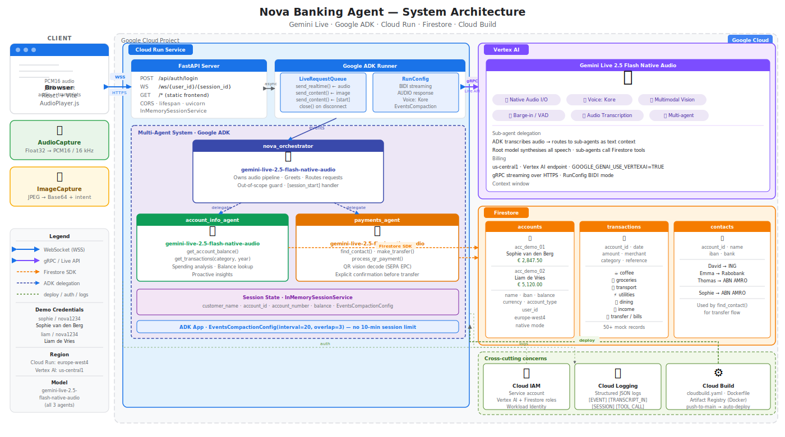

# NorthRiver Banking Agent

> **Voice-first AI banking assistant powered by Google ADK & Gemini Live**
> Gemini Live Agent Challenge submission — March 2026

NorthRiver Bank introduces **River** — a voice AI that lets customers check balances, transfer money, and pay bills by photo, entirely through natural conversation. No taps, no forms, no branch visits. Just speak.

---

## Architectural Diagram



---

## Demo Flows

| # | Flow | How it works |
|---|------|-------------|
| 1 | **Spending Query** | *"How much did I spend on coffee last year?"* → River queries Firestore and answers in plain speech |
| 2 | **Contact Transfer** | *"Send €50 to David"* → River looks up IBAN, confirms details, executes transfer |
| 3 | **QR Bill Payment** | Snap a photo of a bill → River reads the SEPA EPC QR code, confirms amount, pays instantly |

---

## Tech Stack

| Layer | Technology |
|-------|-----------|
| AI Model | Gemini Live 2.5 Flash Native Audio (Vertex AI) |
| Agent Framework | Google ADK (`runner.run_live()`) |
| Backend | Python, FastAPI, WebSocket |
| Database | Google Firestore |
| Frontend | React, Vite, Web Audio API, AudioWorklet |
| Infrastructure | Docker, Google Cloud Run, Cloud Build |

---

## Project Structure

```
banking-agent/
├── banking_agent/
│   ├── agent.py          # Root orchestrator (River)
│   ├── account_info.py   # Account & transaction domain agent
│   ├── payments.py       # Transfers & QR payment domain agent
│   └── db.py             # Firestore client singleton
├── frontend/
│   ├── src/
│   │   ├── components/
│   │   │   ├── BankingInterface.jsx   # Main UI
│   │   │   ├── LoginScreen.jsx        # Auth screen
│   │   │   ├── MicButton.jsx          # Record / speaking states
│   │   │   ├── TranscriptDisplay.jsx  # Live conversation bubbles
│   │   │   └── ImageCapture.jsx       # Bill photo uploader
│   │   ├── AudioCapture.js            # getUserMedia → PCM16 via AudioWorklet
│   │   └── AudioPlayer.js             # PCM16 (24kHz) → Web Audio playback
│   └── index.html
├── assets/
│   ├── architecture.svg               # Architecture diagram
│   └── vattenfall_bill_qr.png         # Demo SEPA EPC QR bill
├── main.py                            # FastAPI server + WebSocket handler
├── seed_data.py                       # Populate Firestore with demo data
├── deploy.sh                          # Cloud Run deployment script
├── cloudbuild.yaml                    # CI/CD pipeline
├── Dockerfile                         # Multi-stage Node + Python build
└── .env.example                       # Environment variable template
```

---

## Getting Started

### Prerequisites

- Python 3.11+
- Node.js 20+
- Google Cloud project with Vertex AI & Firestore enabled
- `gcloud` CLI authenticated

### 1. Clone & configure

```bash
git clone https://github.com/YOUR_USERNAME/northriver-banking-agent.git
cd northriver-banking-agent
cp .env.example .env
# Edit .env with your GCP project details
```

### 2. Install dependencies

```bash
# Python
pip install -r requirements.txt

# Frontend
cd frontend && npm install && cd ..
```

### 3. Seed Firestore

```bash
python seed_data.py
```

This creates the demo account (Sophie van den Berg), contact (David), and generates the Vattenfall demo QR bill in `assets/`.

### 4. Run locally

```bash
# Terminal 1 — backend
uvicorn main:app --port 8080

# Terminal 2 — frontend dev server
cd frontend && npm run dev
```

Open [http://localhost:5173](http://localhost:5173) and sign in with:

| Username | Password |
|----------|----------|
| `sophie` | `nova1234` |
| `liam`   | `nova1234` |

---

## WebSocket Protocol

**Endpoint:** `ws://{host}/ws/{user_id}/{session_id}`

| Direction | Frame type | Payload |
|-----------|-----------|---------|
| Client → Server | Binary | Raw PCM16 audio at 16kHz |
| Client → Server | JSON text | `{"type": "image", "data": "<base64_jpeg>"}` |
| Client → Server | JSON text | `{"type": "text", "content": "..."}` |
| Server → Client | JSON text | `{"type": "audio", "data": "<base64_pcm24>"}` |
| Server → Client | JSON text | `{"type": "transcript_input", "text": "...", "finished": bool}` |
| Server → Client | JSON text | `{"type": "transcript_output", "text": "...", "finished": bool}` |
| Server → Client | JSON text | `{"type": "turn_complete"}` |

---

## Deploy to Cloud Run

```bash
./deploy.sh --project YOUR_GCP_PROJECT --region europe-west4
```

Or with Firestore seeding in one step:

```bash
./deploy.sh --project YOUR_GCP_PROJECT --seed
```

---

## Environment Variables

| Variable | Description |
|----------|-------------|
| `GOOGLE_CLOUD_PROJECT` | GCP project ID |
| `GOOGLE_CLOUD_LOCATION` | Vertex AI region (e.g. `europe-west4`) |
| `GOOGLE_GENAI_USE_VERTEXAI` | Set to `TRUE` for Vertex AI |
| `AGENT_MODEL` | Gemini model alias (default: `gemini-live-2.5-flash-native-audio`) |
| `FIRESTORE_PROJECT` | Firestore project ID (defaults to `GOOGLE_CLOUD_PROJECT`) |
| `DEMO_CREDENTIALS` | Comma-separated `user:pass:account_id:user_id` entries |

---

## Agent Architecture

River uses a **multi-agent hierarchy** built on Google ADK:

```
northriver_orchestrator  (River — greets & routes)
├── account_info_agent   (balances, transactions, spending)
└── payments_agent       (transfers, QR bill payments)
```

The orchestrator routes silently — customers never know sub-agents exist. Each sub-agent has access to a scoped set of Firestore tools and a tightly focused system prompt.

---

## Reproducible Testing (For Judges)

Everything needed to run a full end-to-end demo is included in this repository. Follow these steps exactly to reproduce all three demo flows.

### Prerequisites

| Requirement | Version | Notes |
|-------------|---------|-------|
| Python | 3.11+ | `python --version` |
| Node.js | 20+ | `node --version` |
| Google Cloud project | — | Vertex AI & Firestore APIs enabled |
| `gcloud` CLI | latest | Authenticated via `gcloud auth application-default login` |
| Browser | Chrome / Edge | Required for Web Audio API + AudioWorklet support |
| Microphone | any | Grant permission when prompted |

---

### Step 1 — Clone the repository

```bash
git clone https://github.com/YOUR_USERNAME/northriver-banking-agent.git
cd northriver-banking-agent
```

---

### Step 2 — Configure environment

```bash
cp .env.example .env
```

Open `.env` and fill in your values:

```env
GOOGLE_GENAI_USE_VERTEXAI=TRUE
GOOGLE_CLOUD_PROJECT=your-gcp-project-id
GOOGLE_CLOUD_LOCATION=europe-west4
AGENT_MODEL=gemini-live-2.5-flash-native-audio
FIRESTORE_PROJECT=your-gcp-project-id
DEMO_CREDENTIALS=sophie:nova1234:acc_demo_01:user_demo_01,liam:nova1234:acc_demo_02:user_demo_02
```

> **Note:** `GOOGLE_CLOUD_LOCATION` must be a region that supports Gemini Live on Vertex AI (`us-central1` or `europe-west4`).

---

### Step 3 — Enable GCP APIs

```bash
gcloud services enable \
  aiplatform.googleapis.com \
  firestore.googleapis.com \
  --project=YOUR_GCP_PROJECT
```

---

### Step 4 — Install dependencies

```bash
# Python backend
pip install -r requirements.txt

# React frontend
cd frontend && npm install && cd ..
```

---

### Step 5 — Seed Firestore with demo data

```bash
python seed_data.py
```

This creates:
- **Sophie van den Berg** — demo account `acc_demo_01`, balance €2,847.50, IBAN `NL91ABNA0417164300`
- **David** — saved contact, IBAN `NL86INGB0002445588` (ING)
- **Transaction history** — coffee, groceries, dining, utilities entries for 2025
- **`assets/vattenfall_bill_qr.png`** — Vattenfall energy bill with a SEPA EPC QR code (€94.20, ref `INV-2026-03-8821`)

> ⚠️ Run this once per GCP project. Re-running is safe — it overwrites existing demo documents.

---

### Step 6 — Start the application

**Terminal 1 — Backend**
```bash
uvicorn main:app --port 8080
```

**Terminal 2 — Frontend**
```bash
cd frontend && npm run dev
```

Open **[http://localhost:5173](http://localhost:5173)** in Chrome or Edge.

---

### Step 7 — Sign in

| Field | Value |
|-------|-------|
| Username | `sophie` |
| Password | `nova1234` |

Click **Sign In & Start Session**. Grant microphone access when prompted. River will greet Sophie automatically within 2–3 seconds.

---

### Step 8 — Reproduce the three demo flows

#### ✅ Flow 1 — Spending Query
1. Wait for River's greeting to finish
2. Say: **"How much did I spend on coffee last year?"**
3. ✔ River speaks the total spend
4. ✔ A transaction table appears in the UI listing all coffee transactions

#### ✅ Flow 2 — Contact Transfer
1. Say: **"Send ten euros to David"**
2. River reads back David's IBAN (last 4 digits), the amount, and source account
3. Say: **"Yes"**
4. ✔ River confirms with a reference number
5. ✔ The balance pill updates immediately to reflect the deduction

#### ✅ Flow 3 — QR Bill Payment
1. Click the **📷 Pay a Bill** button (bottom left)
2. Upload `assets/vattenfall_bill_qr.png` (included in the repo)
3. River reads the QR code and says: *"I can see a Vattenfall energy bill for €94.20…"*
4. Say: **"Yes, pay it"**
5. ✔ River confirms the payment with a reference number
6. ✔ The balance pill updates to reflect the deduction

---

### Expected State After All Three Flows

| Item | Starting value | After flows |
|------|---------------|-------------|
| Sophie's balance | €2,847.50 | €2,743.30 (−€10.00 transfer, −€94.20 QR payment) |
| Firestore `transactions` | seeded history | 2 new entries added |
| Firestore `accounts/acc_demo_01` balance | 2847.50 | 2743.30 |

---

### Troubleshooting

| Symptom | Likely cause | Fix |
|---------|-------------|-----|
| River doesn't greet on load | Vertex AI region not supported | Change `GOOGLE_CLOUD_LOCATION` to `us-central1` |
| `404` on model | Model alias not available in your region | Set `AGENT_MODEL=gemini-2.5-flash-native-audio-preview-12-2025` |
| No microphone input | Browser permissions | Click the lock icon in the address bar → allow microphone |
| Firestore permission denied | ADC not set | Run `gcloud auth application-default login` |
| Balance doesn't update | Stale seed data | Re-run `python seed_data.py` then restart the backend |

---

## License

MIT
